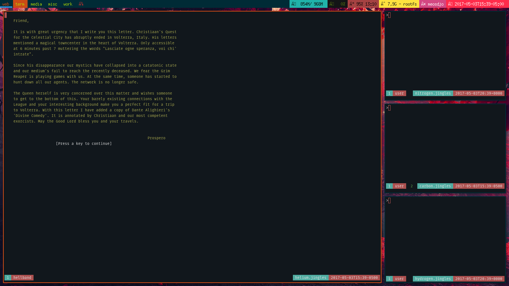

## Install
```bash
# I didn't care if my user lost existing files
cp -r /etc/skel/{*,.*} ~/
```
```bash
# You may.
for DERP in $(ls -l /etc/skel/);do
  [[ -z $HOME/$DERP ]]&&cp -r /etc/skel/$DERP ~/$DERP
done
```
## Uninstall
```bash
echo -e "\t- Have backups"
```
## General
## Screemshot

### TIME
[ISO_8601](https://www.startpage.com/do/dsearch?query=ISO+8601)
### KEYS
#### TMUX
`Ctrl+x`       : Prefix

`prefix+c`     : Create window

`prefix+g`     : Split H

`prefix+v`     : Split V

`prefix+,`     : Window previous

`prefix+.`     : Window next

`prefix+h`     : Window left

`prefix+j`     : Window up

`prefix+k`     : Window down

`prefix+l`     : Window right

#### DWM
`Meta+Shift+Return` : term(st)

`Meta+p`       : menu(run)

`Meta+Tab`     : menu(windows)

`Meta+Shift+w` : web(chromium)

`Meta+Shift+f` : filemanager(st -e ranger)

`Meta+Shift+q` : Quit

`Meta+Shift+c` : Toggl

`Meta+Shift+c` : Kill Client

`Meta+Shift+b` : Toggle Bar

`Meta+Ctrl+f`  : Toggle Float

`Meta+t`       : layout(tile)

`Meta+b`       : layout(bstack)

`Meta+m`       : layout(monocle)

`Meta+f`       : layout(float)
